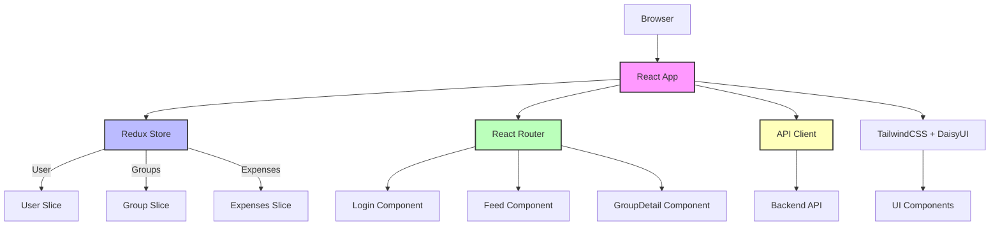

# SplitUp - Expense Management Web App

[](https://opensource.org/licenses/MIT)
[](https://reactjs.org/)
[](https://redux.js.org/)

A modern web application for managing expenses and splitting bills among groups of friends or colleagues. Built with React, Redux Toolkit, and modern UI components.

## 🚀 Features

- 📱 Modern, responsive UI built with TailwindCSS and DaisyUI
- 🔐 Secure authentication with login/signup functionality
- 📂 Group management with photo uploads
- 💰 Expense tracking and splitting
- 📊 Real-time expense summaries
- 🔄 Automatic debt settlement calculations
- 📱 Mobile-friendly design

## 🛠️ Tech Stack

- **Frontend Framework**: React 18.3.1
- **State Management**: Redux Toolkit
- **UI Components**: TailwindCSS + DaisyUI
- **Routing**: React Router DOM
- **API Client**: Axios
- **Build Tool**: Vite

## 📋 Project Structure

```
splitUp-web/
├── public/                 # Static assets
├── src/
│   ├── components/        # React components
│   │   ├── Login.jsx     # Authentication
│   │   ├── Feed.jsx      # Main dashboard
│   │   ├── GroupDetail.jsx # Group management
│   │   ├── Expenses.jsx  # Expense tracking
│   │   └── ...           # Other components
│   ├── store/            # Redux store
│   │   ├── appStore.js   # Root store
│   │   └── slices/       # Redux slices
│   ├── utils/            # Utility functions
│   └── index.css         # Global styles
├── package.json          # Project dependencies
└── vite.config.js       # Build configuration
```

## 📊 Architecture



## 🚀 Getting Started

1. Clone the repository:
```bash
git clone https://github.com/yourusername/splitUp-web.git
cd splitUp-web
```

2. Install dependencies:
```bash
npm install
```

3. Start the development server:
```bash
npm run dev
```

4. Build for production:
```bash
npm run build
```

## 📝 License

This project is licensed under the MIT License - see the LICENSE file for details.

## 🙏 Contributing

1. Fork the repository
2. Create your feature branch (`git checkout -b feature/amazing-feature`)
3. Commit your changes (`git commit -m 'Add some amazing feature'`)
4. Push to the branch (`git push origin feature/amazing-feature`)
5. Open a Pull Request

## 📬 Support

For support, please open an issue in the GitHub repository.

## 🙏 Acknowledgments

- React and the React community
- Redux Toolkit for state management
- TailwindCSS and DaisyUI for beautiful UI components
- All contributors who helped with this project
